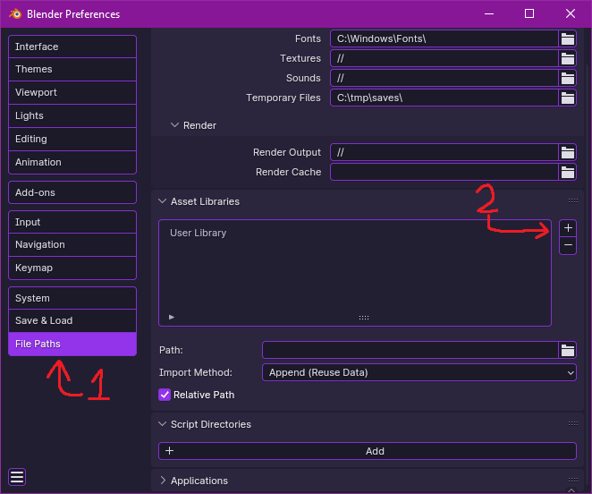
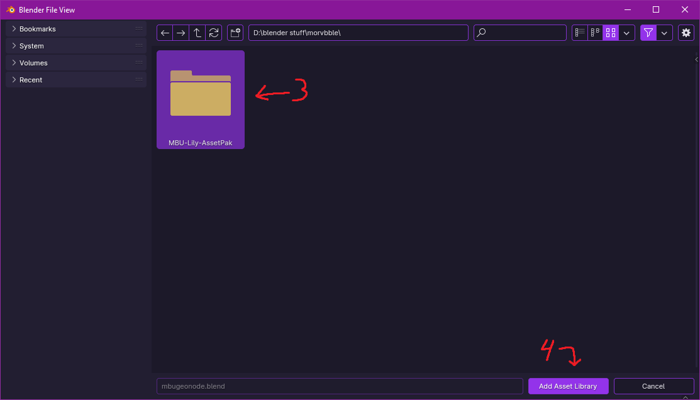
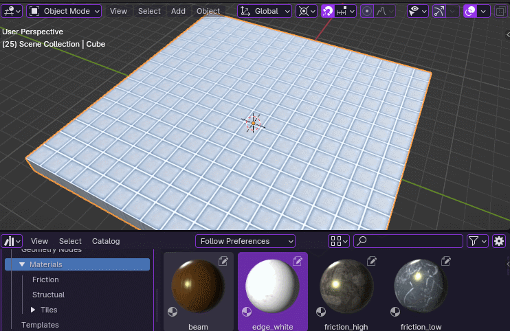
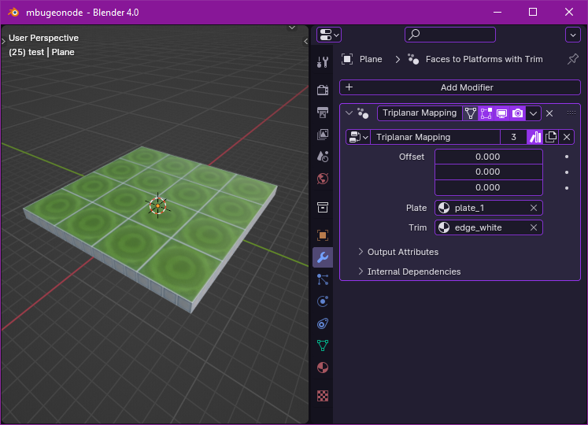
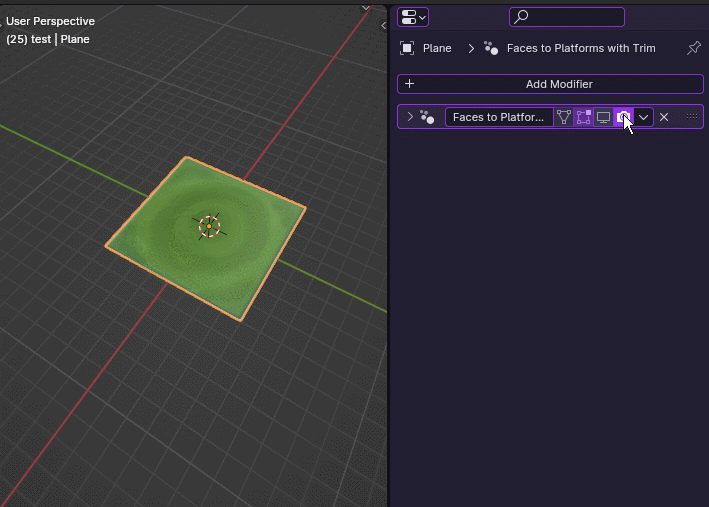
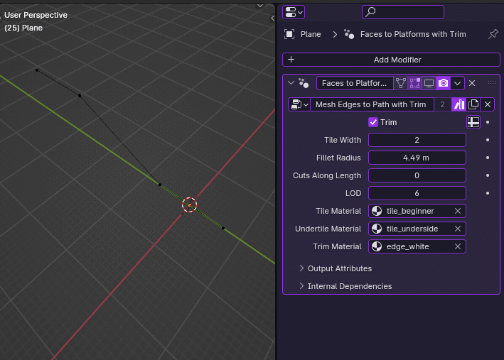
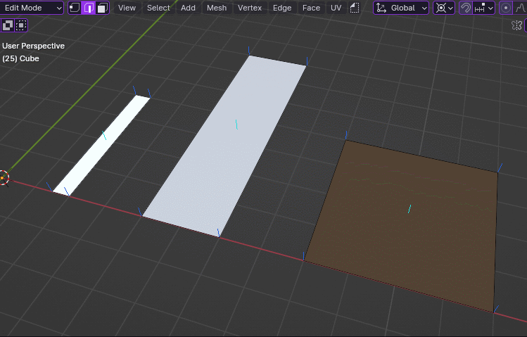
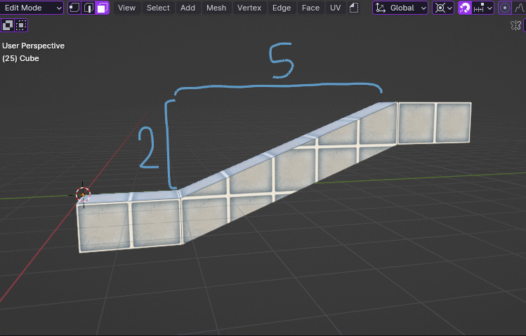
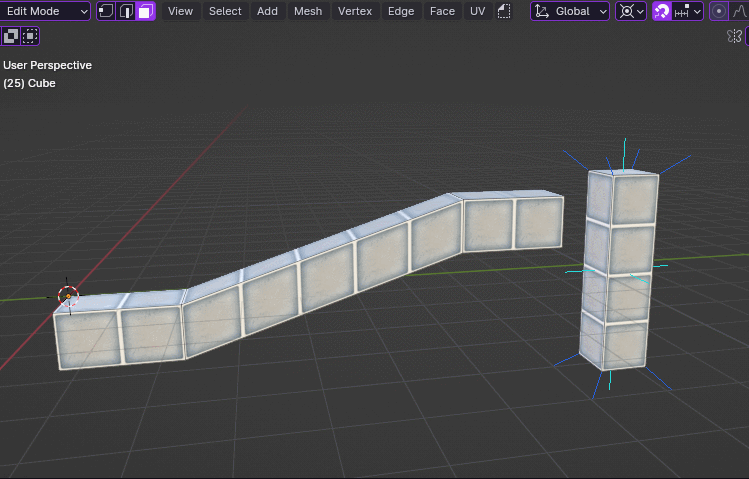
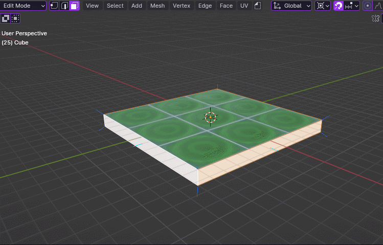

# marbleBlastToolkit
A toolkit for Marble Blast level creation in blender. For use with Blender 4.0+ only.

## Requirements
[IO DIF](https://github.com/RandomityGuy/io_dif/) is needed to export DIFs from Blender to Marble Blast.

## Installation
to install, download the repository and extract the 'MBU-Lily-AssetPak' folder. 
In blender open preferences > File Paths > Asset Libraries (1) and hit the + icon (2).   
   
Navigate the file browser to where you extracted MBU-Lily-AssetPak, select the folder (3) and hit Add Asset Library (4).  
   

# Usage
The marbleBlastToolkit has several gizmos that come packaged within. Tools and Modifiers, triggers and textures, and Shapes that can be placed in Blender that will be stored and loaded within the .DIF via the Create Subs feature.

## Marble Blast Assets

### Materials
Premade Marble Blast Materials with proper names, normal maps and roughtly accurate shading from their corresponding games.

### Shapes/Triggers
For use with embedding Shapes/Triggers in exported DIFs, the Datablocks retaining their original model while also being 1:1 when exporting from Blender to Marble Blast!

## Modifiers
### Triplanar Mapping
UV Unwraps entire mesh using Triplanar mapping

- Offset: XYZ Offset of the triplanar mapping
- Materials:
  - By default all materials are mapped to Tile-scale
  - Plate: Maps specified material to Plate-scale
  - Trim: Maps specified material to Trim-scale

### Faces to Platforms with Trim
Generates entire platforms from planar faces, trims them, and UV unwraps entire mesh with triplanar mapping.

- Trim: Toggles trim generation
- Materials:
  - Base mesh materials are preserved
  - Undertile Material: Uses specified material for underside of generated Platforms
  - Trim Material: Uses specified material for trim

### Mesh Edges to Path with Trim
Generates paths using mesh edges.

- Trim: Toggles trim generation
- Generation options:
  - Tile Width: How wide the path is in whole tiles
  - Fillet Radius: How long to curve sharp edges
  - Cuts Along Length: How much the faces running length-wise should be subdivided, potentially providing better looking UVs
  - LOD (Leve of Detail): How many segments the Fillet creates
- Materials:
  - Tile Material: Uses specified material for tiles
  - Undertile Material: Uses specified material for undertile
  - Trim Material: Uses specified material for trim

### Mesh Edges to Beam
Generates beams using mesh edges.

- Creating a vertex group named "Bottom-Out" lets you specify which parts of the beam 'bottom out' at the same height
  - this makes it easier to have uniform beams ending far below the level, without having to precisely line them up yourself
  - Bottom Offset: Extends how far down the beams 'bottom out' past the base object's origin
 
## Tools
### Triplanar Mapping
UV Unwraps selected faces using triplanar mapping with predefined scales for specific materials

- Materials:
  - Tile: The tool defaults to mapping to Tile-scale
  - Trim: Scales the mapping to Trim-scale
  - Plate: Scales the mapping to Plate-scale
- Offset: XYZ offset for the mapping
- Scale: Overall scale applied after predefined scales

### Skew and Shift UVs
Skew along the X and Y axis

Shift along the X and Y axis

- You can enter equations into number fields and Blender will automatically evaluate them and use the result
  - You can also hit the Minus key to negate the field your cursor is hovering over
 
### Quantize Trim Aligned
Quantize/round selected vertices to Trim-scale grid

### Trim
Extrude selected faces evenly

- This does not automatically apply a trim material, as it's not possible to specify a specific material in a tool
- Scale: How much to extrude the trim
- Triplanar Map: whether or not to automatically unwrap the new geometry with triplanar mapping
  - it's best to keep this on
  - Offset: XYZ offset of the triplanar mapping
