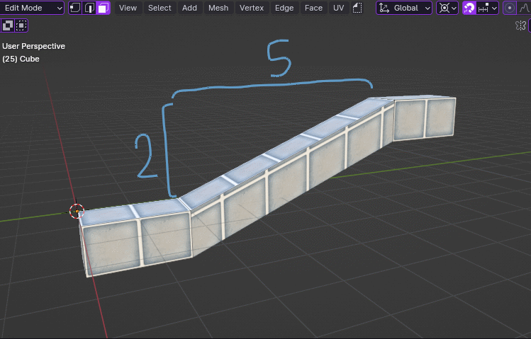
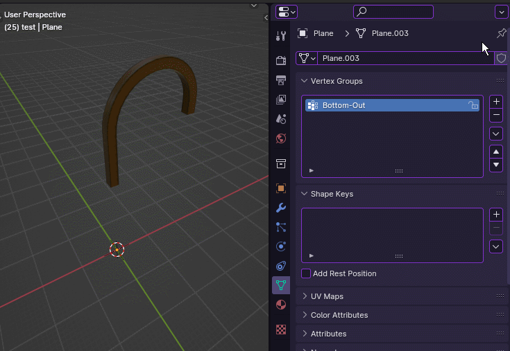

# marbleBlastToolkit
A toolkit for Marble Blast level creation in blender. For use with Blender 4.0+ only.

# Installation

to install, download the repository and extract the 'MBU-Lily-AssetPak' folder. 
In blender open preferences > File Paths > Asset Libraries (1) and hit the + icon (2).   
   
Navigate the file browser to where you extracted MBU-Lily-AssetPak, select the folder (3) and hit Add Asset Library (4).  
   

# Usage

## Tools

### Triplanar Mapping
UV Unwraps selected faces using triplanar mapping with predefined scales for specific materials

- Materials:
    - The tool defaults to mapping to Tile-scale
    - Trim: Scales the mapping to Trim-scale
    - Plate: Scales the mapping to Plate-scale
- Offset: XYZ offset for the mapping
- Scale: Overall scale applied after predefined scales

### Skew and Shift UVs
Skew along the X and Y axis 
   
Shift along the X and Y axis 
 
 - You can enter equations into number fields and Blender will automatically evaluate them and use the result
    - You can also hit the Minus key to negate the field your cursor is hovering over

### Quantize Trim Aligned
Quantize/round selected vertices to Trim-scale grid 
 

### Trim
Extrude selected faces evenly 
 
- This does not automatically apply a trim material, as it's not possible to specify a specific material in a tool
- Scale: How much to extrude the trim
- Triplanar Map: whether or not to automatically unwrap the new geometry with triplanar mapping
    - it's best to keep this on
    - Offset: XYZ offset of the triplanar mapping

## Modifiers

### Triplanar Mapping
UV Unwraps entire mesh using Triplanar mapping 
 
- Offset: XYZ Offset of the triplanar mapping
- Materials:
    - By default all materials are mapped to Tile-scale
    - Plate: Maps specified material to Plate-scale
    - Trim: Maps specified material to Trim-scale

### Faces to Platforms with Trim
Generates entire platforms from planar faces, trims them, and UV unwraps entire mesh with triplanar mapping. 
 
- Trim: Toggles trim generation
- Materials:
    - Base mesh materials are preserved
    - Undertile Material: Uses specified material for underside of generated Platforms
    - Trim Material: Uses specified material for trim

### Mesh Edges to Path with Trim
Generates paths using mesh edges. 
 
- Trim: Toggles trim generation
- Generation options:
    - Tile Width: How wide the path is in whole tiles
    - Fillet Radius: How long to curve sharp edges
    - Cuts Along Length: How much the faces running length-wise should be subdivided, potentially providing better looking UVs
    - LOD (Leve of Detail): How many segments the Fillet creates
- Materials:
    - Tile Material: Uses specified material for tiles
    - Undertile Material: Uses specified material for undertile
    - Trim Material: Uses specified material for trim

### Mesh Edges to Beam
Generates beams using mesh edges. 
 
- Creating a vertex group named "Bottom-Out" lets you specify which parts of the beam 'bottom out' at the same height
    - this makes it easier to have uniform beams ending far below the level, without having to precisely line them up yourself
    - Bottom Offset: Extends how far down the beams 'bottom out' past the base object's origin
## MBU Assets

### Materials
 
Premade MBU Materials with proper names, normal maps and roughtly accurate shading

### Entities (PQ, OpenMBU)
For use with embedding entities in exported DIFs, eventually I plan to redo the models with actual shapes
